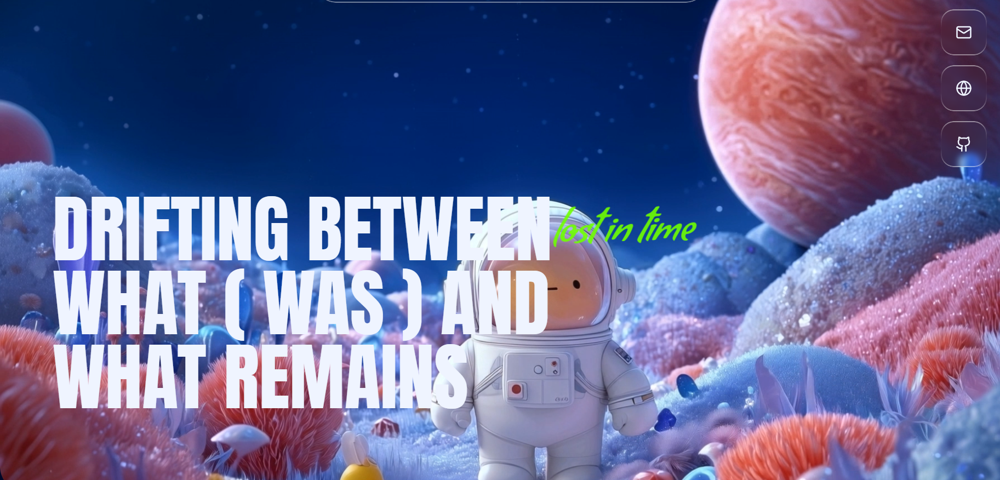

# VOIDMARK

> Drifting Between What Was and What Remains



**VOIDMARK** is a space-time NFT archive — frozen moments transmitted from the edge of every era. Mint signals from the void.

## ✦ Overview

VOIDMARK captures fleeting moments across time and space, preserving them as unique digital artifacts on the blockchain. Each NFT is a signal — a fragment of reality frozen at the boundary between what was and what remains.

## ✦ Features

- **Immersive Landing Experience** — A cinematic hero section with dynamic visuals and ambient storytelling
- **Curated Collection Gallery** — Browse the archive of minted space-time signals
- **About Section** — Discover the lore and philosophy behind VOIDMARK
- **Call to Action** — Join the archive and mint your own signals from the void
- **Responsive Design** — Fully optimized for desktop and mobile experiences
- **Texture Overlays** — Subtle grain and noise effects for a premium analog-digital aesthetic

## ✦ Tech Stack

- **React 18** — UI library
- **TypeScript** — Type-safe development
- **Vite** — Lightning-fast build tool
- **Tailwind CSS** — Utility-first styling
- **Radix UI** — Accessible component primitives
- **React Router** — Client-side routing
- **TanStack React Query** — Server state management
- **Recharts** — Data visualization

## ✦ Getting Started

### Prerequisites

- Node.js (v18 or higher)
- npm or bun

### Installation

```bash
# Clone the repository
git clone https://github.com/NithinVarma50/orbis-launchpad.git
cd orbis-launchpad

# Install dependencies
npm install

# Start the development server
npm run dev
```

The app will be available at `http://localhost:8080`.

### Build for Production

```bash
npm run build
npm run preview
```

## ✦ Project Structure

```
orbis-launchpad/
├── public/              # Static assets & OG image
├── src/
│   ├── components/      # Reusable UI components
│   │   ├── ui/          # Base UI primitives (shadcn/ui)
│   │   ├── Hero.tsx     # Landing hero section
│   │   ├── About.tsx    # About section
│   │   ├── Collection.tsx  # NFT collection gallery
│   │   ├── CTA.tsx      # Call to action
│   │   └── ...
│   ├── pages/           # Route pages
│   ├── hooks/           # Custom React hooks
│   ├── lib/             # Utility functions
│   └── App.tsx          # Root app component
├── index.html           # Entry HTML with SEO meta tags
└── vite.config.ts       # Vite configuration
```

## ✦ Author

**Nithinvarma**

## ✦ License

All rights reserved.
